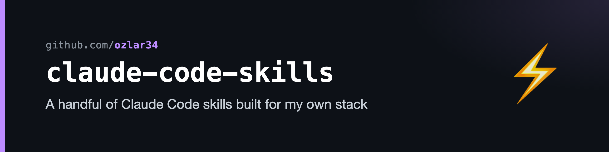

# Claude Code Skills

A handful of [Claude Code](https://www.anthropic.com/claude-code) skills I built for my own stack — Obsidian, Notion, and a few general-purpose utilities.

Skills are markdown files under `~/.claude/skills/` that Claude Code auto-loads and triggers on natural-language matches. They let you turn repeated workflows into one-shot voice/text commands.

Each skill is packaged for reuse: copy the directory, fill in the `SETUP.md` placeholders, and it runs without depending on my private config.

## Works across tools

These skills follow the [Agent Skills](https://agentskills.io) open standard, published by Anthropic in December 2025. Any coding assistant that supports the standard — Cursor, OpenAI Codex CLI, Google Antigravity, GitHub Copilot, VS Code, JetBrains, and 20+ others — loads them from `~/.claude/skills/` without modification. Install once; they're available everywhere.

## Catalog

| Skill | Category | One-liner |
|---|---|---|
| [`braindump`](./source/braindump) | Thinking | Develops a raw, half-formed idea through adaptive one-question-at-a-time dialogue — what it is, what could be done with it, the smallest next step. Scales depth to the idea; writes nothing. |
| [`second-opinion`](./source/second-opinion) | Verification | Pull a fresh, independent Opus agent in to verify the last load-bearing claim the assistant made — confirmed / refuted / can't tell, with evidence. On-demand escalation for cheaper sessions; relays the verdict verbatim instead of rubber-stamping its own reasoning. |
| [`session-handoff`](./source/session-handoff) | Workflow | Generate a structured handoff block when context is hot, mid-stream. Persists to disk + clipboard so a fresh session can resume after `/clear`. |
| [`github-polish`](./source/github-polish) | GitHub automation | Make a public repo recruiter-ready in one pass — topics, description, worked-example README, LICENSE, honest CLI/UI handback. `gh`-only core (hand the repo link to your assistant and it installs itself), plus an optional rendering add-on for branded social cards / banners / diagrams. |
| [`claude-inbox`](./source/claude-inbox) | Capture | Triage an Apple Reminders capture list one item at a time. Pair with a Siri shortcut for hands-free mobile capture. |
| [`triage`](./source/triage) | Capture | GTD-triage a captured-clippings inbox — analyze each, route, delete. Store-agnostic; wire it to your own vault or task manager. |
| [`sell`](./source/sell) | Web automation | Drives the Kleinanzeigen post-ad form via Playwright MCP. Fills every field, narrates German values back in English, stops before publish. |

## Install

```bash
# Pick one
cp -r source/braindump ~/.claude/skills/
cp -r source/second-opinion ~/.claude/skills/
cp -r source/session-handoff ~/.claude/skills/
cp -r source/github-polish ~/.claude/skills/
cp -r source/claude-inbox ~/.claude/skills/
cp -r source/triage ~/.claude/skills/
cp -r source/sell ~/.claude/skills/

# Then read the SETUP.md in the copied folder for any placeholders to fill in.
```

Restart Claude Code (or open a new session). The skill auto-surfaces — invoke it with `/<skill-name>` or by triggering the natural-language pattern in its description.

## More

- [ozlar34/ozlar34](https://github.com/ozlar34) — profile and pinned projects
- Skills not in this repo: 5 job-search skills wired into a private n8n + Supabase + Apify pipeline. Architecture lives in [job-match-radar](https://github.com/ozlar34/job-match-radar).
